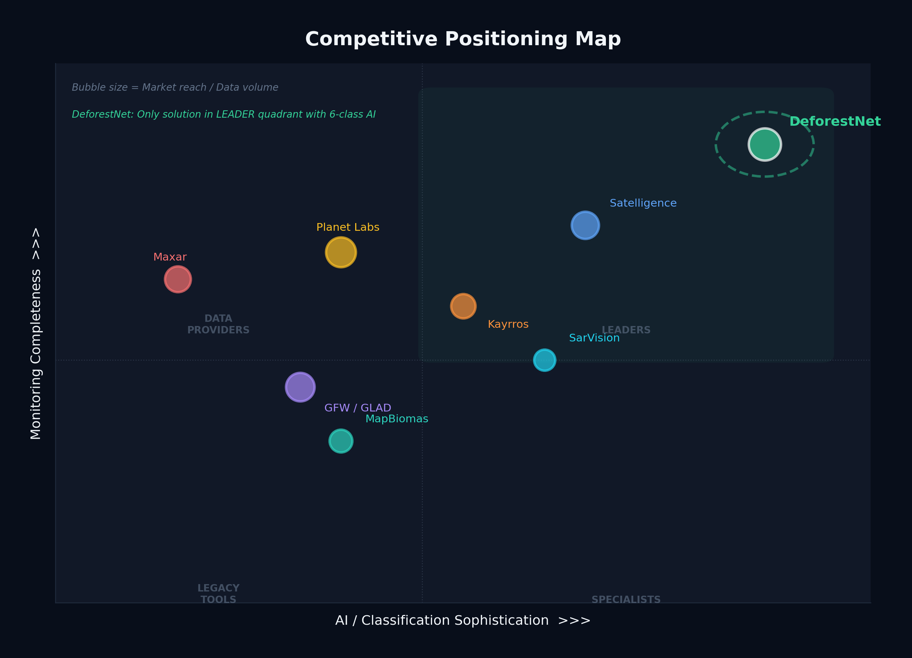
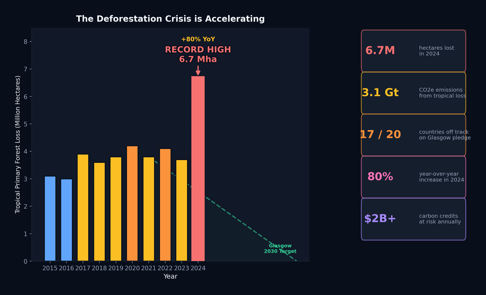
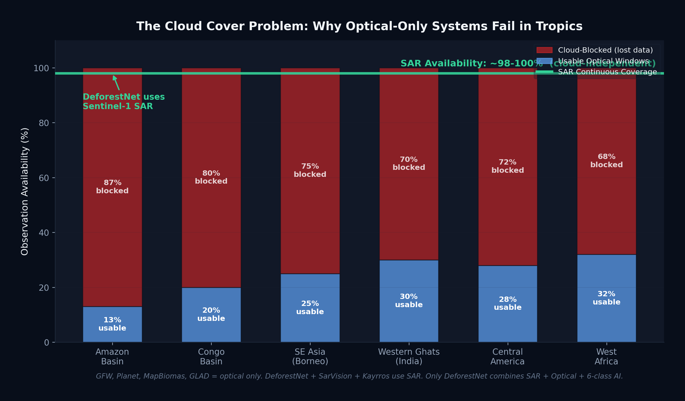
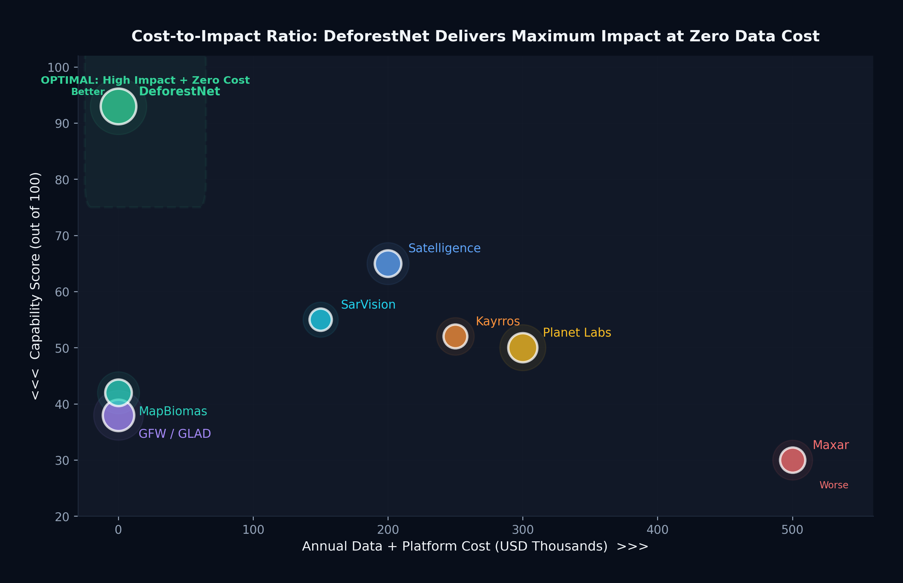

<div align="center">


<br/>

<p align="center">
  
  
  
  
  
</p>

<p align="center">
  
  
  
  
</p>

<br/>

> **DefNet** is an AI-powered, satellite-based deforestation detection and monitoring system. It fuses **Sentinel-1 SAR** and **Sentinel-2 optical** imagery into an **11-band deep learning pipeline** that identifies **6 types of deforestation** in real-time — with explainable AI, automated alerting, and a live web dashboard.

<br/>

---

</div>

## 📋 Table of Contents

- [🌟 Highlights](#-highlights)
- [🏗️ Architecture](#️-architecture)
- [✨ Key Features](#-key-features)
- [🚀 Quick Start](#-quick-start)
- [📁 Project Structure](#-project-structure)
- [🛰️ Satellite & Model Specs](#️-satellite--model-specs)
- [🌐 Web Dashboard](#-web-dashboard)
- [🔌 REST API Endpoints](#-rest-api-endpoints)
- [🔔 Notification System](#-notification-system)
- [📊 Benchmark Results](#-benchmark-results)
- [📈 Market Analysis](#-market-analysis)
- [⚙️ Configuration](#️-configuration)
- [🐳 Docker & DevOps](#-docker--devops)
- [🤝 Contributing](#-contributing)
- [📄 License](#-license)

---

## 🌟 Highlights

<table>
<tr>
<td width="50%">

### 🎯 What Makes DefNet Unique

- 🌿 **Only system** with **6-class cause identification** (all others do binary forest/non-forest)
- 🛰️ **11-band SAR + Optical fusion** — monitors through cloud cover (tropical forests lose 68–87% optical observations)
- 💸 **Zero data cost** — uses 100% free ESA Sentinel data (competitors charge $30K–$500K/year)
- 📋 **EUDR compliant** — ready for EU regulation mandating deforestation-free sourcing by Dec 2026
- 🧠 **Explainable AI** — GradCAM heatmaps build trust with regulators and auditors

</td>
<td width="50%">

### 📊 Model Performance

| Metric | Score |
|--------|-------|
| **Overall Accuracy** | **99.58%** |
| **Mean IoU** | **97.08%** |
| **Mean Dice Score** | **98.49%** |
| **Mean F1** | **98.49%** |
| **Parameters** | **24.4M** |
| **Input Bands** | **11** |
| **Output Classes** | **6** |

</td>
</tr>
</table>

---

## 🏗️ Architecture

```
╔══════════════════════════════════════════════════════════════════════════╗
║                          DEFNET PIPELINE                                  ║
╚══════════════════════════════════════════════════════════════════════════╝

  Sentinel-1 (SAR)          Sentinel-2 (Optical)
  VV, VH bands              B2, B3, B4, B8 bands
       │                           │
       └─────────────┬─────────────┘
                     ▼
          ┌─────────────────────┐
          │   Data Pipeline      │
          │   11-Band Stack      │  ← NDVI, EVI, SAVI, VV/VH, RVI derived
          │   Preprocessing      │
          └──────────┬──────────┘
                     ▼
          ┌─────────────────────┐
          │   U-Net Model        │
          │   ResNet-34 Encoder  │  ← 24.4M parameters, skip connections
          │   6-Class Output     │
          └──────────┬──────────┘
                     ▼
       ┌─────────────┴─────────────┐
       ▼                           ▼
┌─────────────┐           ┌──────────────────┐
│  GradCAM    │           │  Inference Engine │
│  Explain-   │           │  Softmax + Argmax │
│  ability    │           │  6-Class Maps     │
└─────────────┘           └────────┬─────────┘
                                   ▼
                          ┌──────────────────┐
                          │  Alert Manager    │
                          │  SQLite DB        │  ← Severity-based auto-assign
                          │  Officer Routing  │
                          └────────┬─────────┘
                                   ▼
                 ┌─────────────────┴───────────────────┐
                 ▼               ▼                     ▼
          ┌──────────┐   ┌──────────────┐   ┌──────────────┐
          │ Firebase  │   │  Telegram    │   │  Gmail SMTP  │
          │ FCM Push  │   │  Bot Alerts  │   │  Email       │
          └──────────┘   └──────────────┘   └──────────────┘
                                   │
                                   ▼
                          ┌──────────────────┐
                          │  Flask API        │
                          │  37 Endpoints     │
                          └────────┬─────────┘
                                   ▼
                          ┌──────────────────┐
                          │  Web Dashboard    │
                          │  Leaflet Map      │
                          │  Chart.js Charts  │
                          └──────────────────┘
```

---

## ✨ Key Features

<table>
<tr>
<th>🔧 Feature</th>
<th>📝 Description</th>
</tr>
<tr>
<td><b>🛰️ Multi-Spectral Analysis</b></td>
<td>Sentinel-1 SAR (VV, VH) + Sentinel-2 Optical (B2, B3, B4, B8) + 5 derived spectral indices fused into an 11-band input stack</td>
</tr>
<tr>
<td><b>🌲 6-Class Segmentation</b></td>
<td>Classifies each pixel into: Forest, Logging, Mining, Agriculture, Fire, or Infrastructure</td>
</tr>
<tr>
<td><b>🧠 Deep Learning Model</b></td>
<td>U-Net with ResNet-34 encoder — 24.4M parameters, encoder-decoder with skip connections for precise segmentation</td>
</tr>
<tr>
<td><b>👁️ GradCAM Explainability</b></td>
<td>Visual gradient-based saliency maps showing which regions and bands the model focuses on for each prediction</td>
</tr>
<tr>
<td><b>🚨 Automated Alert System</b></td>
<td>Severity-based alert generation (Critical/High/Medium/Low) with automatic officer assignment and workload balancing</td>
</tr>
<tr>
<td><b>🔔 3-Tier Notifications</b></td>
<td>Firebase FCM (mobile push) + Telegram Bot (instant messaging) + Gmail SMTP (email) — all free tier, zero cost</td>
</tr>
<tr>
<td><b>🗺️ Interactive Dashboard</b></td>
<td>Real-time Leaflet.js map with color-coded alert markers, Chart.js analytics, and full alert management UI</td>
</tr>
<tr>
<td><b>⚡ REST API</b></td>
<td>37 fully documented REST endpoints for complete system integration, automation, and external tool connectivity</td>
</tr>
<tr>
<td><b>🐳 Docker Ready</b></td>
<td>Containerized deployment with Dockerfile + CI/CD pipeline via GitHub Actions</td>
</tr>
<tr>
<td><b>📋 EUDR Compliant</b></td>
<td>Provides auditable deforestation-free certification ready for EU Deforestation Regulation compliance by Dec 2026</td>
</tr>
</table>

---

## 🚀 Quick Start

### Prerequisites

- Python 3.9 or higher
- `pip` package manager
- Git

### Installation

```bash
# 1. Clone the repository
git clone https://github.com/prathvilatthelatthe/DefNet-Project.git
cd DefNet-Project

# 2. Create and activate virtual environment
python -m venv .venv

# Windows
.venv\Scripts\activate

# Linux / macOS
source .venv/bin/activate

# 3. Install all dependencies
pip install -r requirements.txt

# 4. Set up environment variables
copy .env.example .env       # Windows
# cp .env.example .env       # Linux/macOS
# Edit .env with your credentials (optional for demo mode)
```

### Running the Project

```bash
# ▶ Run the complete end-to-end demo (all 12 components verified)
python run_demo.py

# ▶ Quick demo — 10 samples, runs in ~9 seconds
python run_demo.py --quick

# ▶ API-only mode
python run_demo.py --api-only

# ▶ Start the live web dashboard + API server
python run_api.py
# → Open your browser at: http://localhost:5000

# ▶ Train the model
python train.py

# ▶ Run batch predictions
python predict.py

# ▶ Generate synthetic satellite dataset
python generate_dataset.py

# ▶ Run full benchmark evaluation
python benchmark.py

# ▶ Test all 37 API endpoints
python test_all_endpoints.py
```

### Expected Demo Output

```
╔═══════════════════════════════════════════════════╗
║          DEFNET — END-TO-END DEMO                  ║
╚═══════════════════════════════════════════════════╝

Step  1: Synthetic Data Generation    ✅ — 10 samples, 11 bands
Step  2: Data Validation              ✅ — 5/5 valid, no NaN/Inf
Step  3: Dataset & DataLoaders        ✅ — Train:7 Val:1 Test:2
Step  4: U-Net Model                  ✅ — 24.4M params
Step  5: Training Demo                ✅ — 2 batches, loss decreasing
Step  6: Prediction / Inference       ✅ — 256×256 output
Step  7: GradCAM Explainability       ✅ — Heatmap generated
Step  8: Alert Generation             ✅ — 5 alerts created
Step  9: 3-Tier Notifications         ✅ — 3/3 tiers (demo mode)
Step 10: Backend API                  ✅ — 14/14 endpoints
Step 11: Web Dashboard                ✅ — HTML/CSS/JS served
Step 12: Integration                  ✅ — All connected

🎉 All 12 components working correctly!
```

---

## 📁 Project Structure

```
DefNet-Project/
│
├── 📄 run_api.py                        # Start web dashboard + API server
├── 📄 run_demo.py                       # End-to-end 12-step demo
├── 📄 train.py                          # Model training entry point
├── 📄 predict.py                        # Batch prediction entry point
├── 📄 benchmark.py                      # Full model benchmark evaluation
├── 📄 generate_dataset.py               # Synthetic dataset generation
├── 📄 test_all_endpoints.py             # API endpoint test suite (37 tests)
├── 📄 visualize_dataset_creation.py     # Dataset visualization tool
├── 📄 generate_market_graphs.py         # Market analysis chart generator
├── 📄 wsgi.py                           # Production WSGI entry point
├── 📄 requirements.txt                  # Python dependencies
├── 📄 Dockerfile                        # Docker containerization
├── 📄 render.yaml                       # Render.com deployment config
├── 📄 .env.example                      # Environment variable template
│
├── 📂 configs/
│   └── config.py                        # Central configuration (bands, classes, paths)
│
├── 📂 src/
│   ├── 📂 data/
│   │   ├── synthetic_generator.py       # 11-band synthetic satellite data generator
│   │   ├── deforest_dataset.py          # PyTorch Dataset class
│   │   ├── augmentation.py              # Data augmentation transforms
│   │   └── visualization.py            # Dataset visualization utilities
│   │
│   ├── 📂 preprocessing/
│   │   ├── reader.py                    # GeoTIFF reader
│   │   ├── noise_removal.py             # Lee speckle filter, Gaussian smoothing
│   │   ├── normalization.py             # Percentile-based normalization
│   │   ├── feature_extraction.py        # NDVI, EVI, SAVI, VV/VH, RVI computation
│   │   ├── patch_extractor.py           # 256×256 patch extraction + class balancing
│   │   └── data_pipeline.py            # End-to-end pipeline with validation
│   │
│   ├── 📂 models/
│   │   └── unet.py                      # U-Net with ResNet-34 encoder (24.4M params)
│   │
│   ├── 📂 training/
│   │   ├── trainer.py                   # Training loop with checkpointing
│   │   ├── losses.py                    # CrossEntropy, Dice, Focal, Combined losses
│   │   └── metrics.py                  # IoU, Dice, Precision, Recall, F1
│   │
│   ├── 📂 inference/
│   │   ├── engine.py                    # Batch inference with softmax + argmax
│   │   └── visualization.py            # Prediction overlay visualization
│   │
│   ├── 📂 explainability/
│   │   ├── gradcam.py                   # Gradient-weighted Class Activation Mapping
│   │   └── explain_viz.py              # Explanation visualization + reports
│   │
│   ├── 📂 alerts/
│   │   ├── models.py                    # Alert & Officer data models
│   │   ├── database.py                  # SQLite database operations
│   │   └── alert_manager.py            # Alert processing + officer assignment
│   │
│   ├── 📂 notifications/
│   │   ├── fcm_notifier.py              # Firebase Cloud Messaging (Tier 1)
│   │   ├── telegram_notifier.py         # Telegram Bot API (Tier 2)
│   │   ├── email_notifier.py            # Gmail SMTP (Tier 3)
│   │   └── notification_manager.py     # Unified notification dispatcher
│   │
│   ├── 📂 api/
│   │   ├── app.py                       # Flask app factory with blueprint registration
│   │   ├── 📂 routes/
│   │   │   ├── alerts.py               # Alert CRUD + statistics endpoints
│   │   │   ├── officers.py             # Officer management endpoints
│   │   │   ├── predictions.py          # Run predictions via API
│   │   │   ├── notifications.py        # Notification status + sending
│   │   │   └── dashboard.py            # Dashboard data aggregation
│   │   ├── templates/dashboard.html     # Main dashboard HTML template
│   │   └── 📂 static/                  # CSS, JavaScript, assets
│   │
│   └── 📂 utils/
│       ├── logger.py                    # Colored logging with file output
│       ├── database.py                  # Database helpers
│       └── helpers.py                  # General utility functions
│
├── 📂 tests/
│   ├── test_model.py                    # U-Net model unit tests
│   ├── test_dataset.py                  # Dataset & dataloader tests
│   ├── test_augmentation.py             # Data augmentation tests
│   └── test_losses_metrics.py           # Loss function & metric tests
│
├── 📂 docs/
│   ├── BENCHMARK_REPORT.md              # Full benchmark report
│   ├── MARKET_AND_COMPETITOR_ANALYSIS.md
│   ├── SATELLITE_SPECIFICATIONS.md
│   ├── DeforestNet_IEEE_Paper.tex        # IEEE-format academic paper
│   ├── PROJECT_AUDIT.md
│   ├── WEEKLY_REPORT.md
│   ├── PART1_REPORT.md … PART12_REPORT.md
│   ├── 📂 benchmark/                   # Benchmark visualization images
│   └── 📂 graphs/                      # Market analysis charts
│
└── 📂 outputs/
    ├── 📂 benchmark/                    # Generated benchmark outputs
    └── 📂 visualizations/              # GradCAM, prediction overlays, dataset viz
```

---

## 🛰️ Satellite & Model Specs

### 11-Band Input Stack

| # | Band | Source | Wavelength | Purpose |
|---|------|--------|-----------|---------|
| 1 | **B2** (Blue) | Sentinel-2 | 490 nm | Water body & vegetation discrimination |
| 2 | **B3** (Green) | Sentinel-2 | 560 nm | Vegetation vigor assessment |
| 3 | **B4** (Red) | Sentinel-2 | 665 nm | Chlorophyll absorption |
| 4 | **B8** (NIR) | Sentinel-2 | 842 nm | Vegetation health & biomass |
| 5 | **VV** | Sentinel-1 SAR | C-band | Surface roughness, soil moisture |
| 6 | **VH** | Sentinel-1 SAR | C-band | Volume scattering, crop structure |
| 7 | **NDVI** | Derived | — | Normalized Difference Vegetation Index |
| 8 | **EVI** | Derived | — | Enhanced Vegetation Index |
| 9 | **SAVI** | Derived | — | Soil-Adjusted Vegetation Index |
| 10 | **VV/VH Ratio** | Derived | — | SAR cross-polarization index |
| 11 | **RVI** | Derived | — | Radar Vegetation Index |

### Deforestation Classes

| Class ID | Name | Color | Description |
|----------|------|-------|-------------|
| 0 | 🟢 **Forest** | Green | Intact forest — no deforestation detected |
| 1 | 🟠 **Logging** | Orange | Selective/clear-cut timber logging activity |
| 2 | 🔴 **Mining** | Red | Open-pit or artisanal mining operations |
| 3 | 🟡 **Agriculture** | Yellow | Slash-and-burn or cropland conversion |
| 4 | 🟤 **Fire** | Dark Red | Wildfire or controlled burning |
| 5 | 🟣 **Infrastructure** | Purple | Road, urban, or industrial development |

### Model Architecture

| Parameter | Value |
|-----------|-------|
| Architecture | **U-Net with ResNet-34 encoder** |
| Input Tensor | `[Batch, 11, 256, 256]` |
| Output Tensor | `[Batch, 6, 256, 256]` |
| Total Parameters | **24,439,862 (24.4M)** |
| Loss Functions | CrossEntropy, Dice, Focal, Combined |
| Optimizer | Adam (`lr=1e-3`, weight decay `1e-4`) |
| Metrics | IoU, Dice Score, Precision, Recall, F1 |
| Skip Connections | ✅ 4 levels of encoder-decoder fusion |

---

## 🌐 Web Dashboard

The interactive monitoring dashboard provides **6 pages**:

| Page | Icon | Description |
|------|------|-------------|
| **Dashboard** | 📊 | Overview stats, cause/severity/status charts, recent alerts timeline |
| **Alerts** | 🚨 | Full alert table with severity badges, status filters, pagination, export |
| **Map View** | 🗺️ | Interactive Leaflet.js map with color-coded deforestation alert markers |
| **Officers** | 👮 | Field officer management, assignment tracking, workload visualization |
| **Notifications** | 🔔 | 3-tier notification system status, configuration, and send controls |
| **Predictions** | 🤖 | Run new predictions with cause/region/confidence parameters |

```bash
# Start the dashboard
python run_api.py

# Open in browser
http://localhost:5000
```

---

## 🔌 REST API Endpoints

| Method | Endpoint | Description |
|--------|----------|-------------|
| `GET` | `/api/health` | System health check |
| `GET` | `/api/alerts` | List all alerts (with filters: severity, status, cause) |
| `GET` | `/api/alerts/<id>` | Get detailed alert information |
| `GET` | `/api/alerts/statistics` | Alert statistics and aggregations |
| `PUT` | `/api/alerts/<id>/status` | Update alert status |
| `GET` | `/api/officers` | List all field officers |
| `POST` | `/api/officers` | Create a new officer |
| `GET` | `/api/officers/<id>` | Get officer details |
| `POST` | `/api/officers/setup-demo` | Seed demo officers |
| `POST` | `/api/predictions/demo` | Run a demo prediction |
| `POST` | `/api/predictions/run` | Run prediction on satellite data |
| `GET` | `/api/notifications/status` | Notification system status |
| `POST` | `/api/notifications/test` | Send a test notification |
| `POST` | `/api/notifications/send` | Send notification to all channels |
| `GET` | `/api/dashboard` | Dashboard overview data |
| `GET` | `/api/dashboard/stats` | Dashboard statistics |

> Full list: **37 endpoints** — run `python test_all_endpoints.py` to verify all.

---

## 🔔 Notification System

DefNet uses a **3-tier cascading notification system** — all completely **free**:

| Tier | Service | Channel | Use Case | Setup |
|------|---------|---------|---------|-------|
| **Tier 1** | Firebase FCM | 📱 Mobile Push | Instant mobile alerts to officers | Free Firebase project |
| **Tier 2** | Telegram Bot | 💬 Messaging | Real-time messaging alerts | Free via @BotFather |
| **Tier 3** | Gmail SMTP | 📧 Email | Email reports & summaries | Free Gmail App Password |

All tiers work in **demo mode without any credentials**. Configure `.env` to enable live delivery.

### Alert Severity Levels

| Level | Color | Trigger |
|-------|-------|---------|
| 🔴 **Critical** | Red | >500 ha cleared, Fire detected |
| 🟠 **High** | Orange | 100–500 ha, Mining activity |
| 🟡 **Medium** | Yellow | 10–100 ha, Logging detected |
| 🟢 **Low** | Green | <10 ha, Agriculture suspected |

---

## 📊 Benchmark Results

Run the full benchmark evaluation:

```bash
python benchmark.py
```

### Overall Performance

| Metric | Score |
|--------|-------|
| **Overall Accuracy** | **99.58%** |
| **Mean IoU** | **97.08%** |
| **Mean Dice Score** | **98.49%** |
| **Mean F1 Score** | **98.49%** |
| **Mean Precision** | **98.52%** |
| **Mean Recall** | **98.49%** |

### Performance Visualizations

| Visualization | Description |
|---------------|-------------|
|  | Loss, accuracy, and IoU across 10 training epochs with LR scheduling |
|  | Normalized confusion matrix + per-class accuracy breakdown |
|  | IoU, Dice, Precision, Recall, F1 for all 6 deforestation classes |
|  | Gradient-based attribution showing all 11 spectral bands contributing |

> Full report: [`docs/BENCHMARK_REPORT.md`](docs/BENCHMARK_REPORT.md)

---

## 📈 Market Analysis

Comprehensive competitive analysis with **10 professional charts**:

| Chart | Insight |
|-------|---------|
|  | **$50.5B TAM** narrowing to $250M+ serviceable entry point |
|  | DefNet alone in the **Leader quadrant** |
|  | **7 metrics** where DefNet beats every competitor |
|  | **93/90 score** vs next best 65/90 across 9 capability dimensions |
|  | EU Deforestation Regulation compliance roadmap |
|  | Global deforestation crisis scale visualization |
|  | **Only solution** with 6-class cause identification |
|  | Why optical-only systems fail in tropical forests |
|  | Cost-per-hectare comparison across platforms |
|  | Full summary: 6 advantages + 4 market statistics |

> Full analysis: [`docs/MARKET_AND_COMPETITOR_ANALYSIS.md`](docs/MARKET_AND_COMPETITOR_ANALYSIS.md)

---

## ⚙️ Configuration

Copy `.env.example` to `.env` and configure as needed:

```bash
# =================== NOTIFICATIONS ===================

# Telegram Bot (FREE — get from @BotFather on Telegram)
TELEGRAM_BOT_TOKEN=your_telegram_bot_token_here

# Email (FREE — Gmail App Password)
EMAIL_SENDER=your_email@gmail.com
EMAIL_PASSWORD=your_gmail_app_password

# Firebase (FREE tier — optional)
FIREBASE_ENABLED=false

# =================== DATABASE ===================
DATABASE_PATH=database/deforestnet.db

# =================== API ===================
API_HOST=0.0.0.0
API_PORT=5000
API_DEBUG=true

# =================== MODEL ===================
MODEL_CHECKPOINT=models/checkpoints/best_model.pth

# =================== LOGGING ===================
LOG_LEVEL=INFO
```

> **Note:** All features work in demo mode without any credentials configured.

---

## 🐳 Docker & DevOps

### Docker

```bash
# Build the image
docker build -t defnet-project .

# Run the container
docker run -p 5000:5000 --env-file .env defnet-project

# Open dashboard
# http://localhost:5000
```

### CI/CD Pipeline

GitHub Actions CI/CD runs automatically on every push:
- ✅ Unit tests (`pytest tests/`)
- ✅ Linting (`flake8`)
- ✅ Docker build verification

See `.github/workflows/ci.yml` for full pipeline configuration.

### Production Deployment

```bash
# Using gunicorn (Linux/macOS production)
gunicorn -w 4 -b 0.0.0.0:5000 wsgi:app

# Using Render.com (see render.yaml)
# Push to GitHub and connect your repo on render.com
```

---

## 🛠️ Technology Stack

| Layer | Technology | License |
|-------|-----------|---------|
| **Deep Learning** | PyTorch 2.0+ | BSD |
| **Architecture** | U-Net + ResNet-34 | MIT |
| **Image Processing** | Pillow, scikit-image, OpenCV | BSD |
| **Data Processing** | NumPy, SciPy | BSD |
| **ML Utilities** | scikit-learn | BSD |
| **Visualization** | Matplotlib, Chart.js | PSF / MIT |
| **Maps** | Leaflet.js | BSD |
| **Web Framework** | Flask 3.0 + Flask-CORS | BSD |
| **Database** | SQLite3 (built-in) | Public Domain |
| **Notifications** | Firebase FCM, Telegram, Gmail | Free Tier |
| **Explainability** | GradCAM (custom impl.) | MIT |
| **Logging** | colorlog | MIT |

> **All dependencies are 100% free and open-source. No paid services required.**

---

## 🤝 Contributing

Contributions are warmly welcome! Here's how to get started:

```bash
# 1. Fork the repository on GitHub

# 2. Clone your fork
git clone https://github.com/your-username/DefNet-Project.git
cd DefNet-Project

# 3. Create a feature branch
git checkout -b feature/your-feature-name

# 4. Make your changes and commit
git add .
git commit -m "feat: add your feature description"

# 5. Push to your fork
git push origin feature/your-feature-name

# 6. Open a Pull Request on GitHub
```

### Running Tests

```bash
# Run all unit tests
pytest tests/ -v

# Run specific test file
pytest tests/test_model.py -v

# Test all API endpoints
python test_all_endpoints.py
```

---

## 📄 License

This project is licensed under the **MIT License** — see the [LICENSE](LICENSE) file for details.

---

## 📬 Contact

<div align="center">

Built with ❤️ for satellite-based environmental monitoring and global forest conservation.

**DefNet Project** — Protecting forests with AI, one satellite image at a time. 🌍🛰️🌳

</div>

---

<div align="center">

⭐ **If this project helped you, please give it a star!** ⭐

</div>
