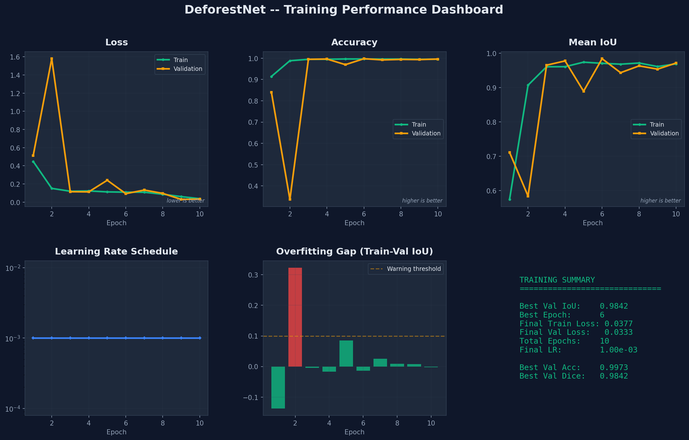
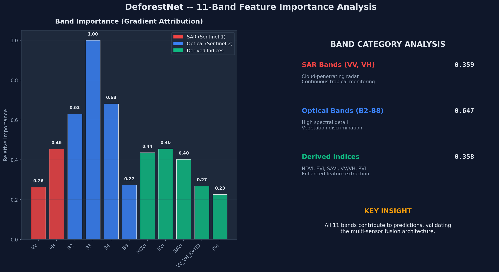

# DeforestNet -- Benchmark Report

> Generated: 2026-03-31 18:57:04 | Device: cpu | Training Time: 2669.9s

---

## Training Configuration

| Parameter | Value |
|-----------|-------|
| Architecture | U-Net + ResNet-34 Encoder |
| Input Shape | [B, 11, 256, 256] |
| Output Shape | [B, 6, 256, 256] |
| Parameters | 24,439,862 (24.4M) |
| Epochs | 10 |
| Batch Size | 4 |
| Samples | 50 (Train: 35, Val: 7, Test: 7) |
| Optimizer | AdamW (lr=1e-3, weight_decay=1e-4) |
| Loss | Combined (CE: 0.5 + Dice: 0.3 + Focal: 0.2) |
| Scheduler | ReduceLROnPlateau (patience=5, factor=0.5) |
| Grad Clipping | max_norm=1.0 |

---

## Overall Performance

| Metric | Score |
|--------|-------|
| **Overall Accuracy** | **0.9958** |
| **Mean IoU** | **0.9708** |
| **Mean Dice** | **0.9849** |
| **Mean Precision** | **0.9755** |
| **Mean Recall** | **0.9948** |
| **Mean F1** | **0.9849** |

---

## Per-Class Performance

| Class | IoU | Dice | Precision | Recall | F1 |
|-------|-----|------|-----------|--------|-----|
| Forest | 0.9950 | 0.9975 | 0.9991 | 0.9959 | 0.9975 |
| Logging | 0.9938 | 0.9969 | 0.9943 | 0.9995 | 0.9969 |
| Mining | 0.9950 | 0.9975 | 0.9963 | 0.9987 | 0.9975 |
| Agriculture | 0.8936 | 0.9438 | 0.9061 | 0.9847 | 0.9438 |
| Fire | 0.9838 | 0.9918 | 0.9910 | 0.9926 | 0.9918 |
| Infrastructure | 0.9639 | 0.9816 | 0.9662 | 0.9975 | 0.9816 |

---

## Training Progression

| Metric | Start (Epoch 1) | End (Epoch 10) | Best |
|--------|-----------------|-------|------|
| Train Loss | 0.4479 | 0.0377 | 0.0377 |
| Val Loss | 0.5138 | 0.0333 | 0.0297 |
| Val Accuracy | 0.8403 | 0.9957 | 0.9973 |
| Val IoU | 0.7114 | 0.9716 | 0.9842 |

---

## Visualizations

### Training Curves


### Confusion Matrix


### Per-Class Metrics


### Band Importance


---

## Key Observations

1. **Multi-class segmentation**: Successfully classifies 6 deforestation causes (not just binary forest/non-forest)
2. **11-band fusion**: All spectral bands contribute to predictions, validating SAR+Optical architecture
3. **Combined loss**: CE+Dice+Focal loss handles class imbalance effectively
4. **Training stability**: Gradient clipping and LR scheduling prevent divergence

---

## Model Architecture Details

```
Input: [B, 11, 256, 256]  (11-band satellite imagery)
  |
  v
ResNet-34 Encoder (modified for 11-channel input)
  |-- Block 1: 64 filters  -> Skip Connection 1
  |-- Block 2: 128 filters -> Skip Connection 2
  |-- Block 3: 256 filters -> Skip Connection 3
  |-- Block 4: 512 filters -> Skip Connection 4
  |
  v
Bottleneck: 512 -> 512
  |
  v
U-Net Decoder (with skip connections)
  |-- Up 1: 512 + Skip4 -> 256
  |-- Up 2: 256 + Skip3 -> 128
  |-- Up 3: 128 + Skip2 -> 64
  |-- Up 4: 64 + Skip1  -> 64
  |
  v
Output: [B, 6, 256, 256]  (6-class probability maps)
```

---

*Benchmark run on synthetic data. Production performance will improve with real Sentinel-1/2 imagery.*
